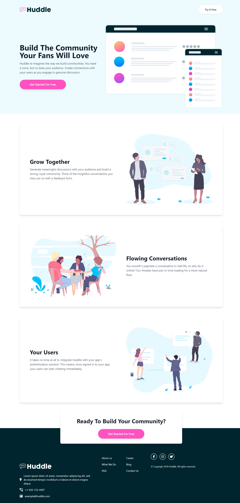

# Frontend Mentor - Huddle Landing Page with Alternating Feature Blocks Solution

This is my solution to the [Huddle landing page with alternating feature blocks challenge on Frontend Mentor](https://www.frontendmentor.io/challenges/huddle-landing-page-with-alternating-feature-blocks-5ca5f5981e82137ec91a5100). It helped me sharpen my layout and responsive design skills using Tailwind CSS and semantic HTML5.

## Table of Contents

- [Overview](#overview)
  - [The Challenge](#the-challenge)
  - [Screenshot](#screenshot)
  - [Links](#links)
- [My Process](#my-process)
  - [Built With](#built-with)
  - [What I Learned](#what-i-learned)
  - [Continued Development](#continued-development)
  - [Useful Resources](#useful-resources)
- [Author](#author)

## Overview

### The Challenge

Users should be able to:

- View the optimal layout for the site depending on their device's screen size
- See hover states for all interactive elements on the page

### Screenshot



### Links

- 🔗 **Solution URL**: [View on Frontend Mentor](https://www.frontendmentor.io/solutions/huddle-landing-page-responsive-flexbox-tailwindcss)
- 🌐 **Live Site URL**: [https://fawaziwalewa.github.io/huddle-landing-page-with-alternating-feature-blocks/](https://fawaziwalewa.github.io/huddle-landing-page-with-alternating-feature-blocks/)

## My Process

### Built With

- Semantic HTML5
- Tailwind CSS
- Flexbox
- Mobile-first responsive design
- Git & GitHub

### What I Learned

While working on this project, I improved how I manage responsive layouts using Tailwind’s utility classes. I also got better at alternating content blocks using `flex-col-reverse` and `md:flex-row` — super useful for these types of layout patterns.

```html
<div class="flex flex-col-reverse items-center gap-10 md:flex-row">
  <div class="md:w-1/2">Text content</div>
  <div class="md:w-1/2"></div>
</div>
```

I also learned to avoid accidental `node_modules` scanning in Tailwind by using specific `content` paths in `tailwind.config.js` for better performance.

### Continued Development

In future projects, I plan to:

- Integrate animation libraries like AOS or GSAP for scroll effects
- Improve accessibility with landmarks and keyboard focus
- Explore more advanced layouts using CSS Grid with Tailwind

### Useful Resources

- [Tailwind CSS Docs](https://tailwindcss.com/docs) – For all utility classes

## Author

- Website – [iwaola.me](https://iwaola.me)
- Frontend Mentor – [@fawaziwalewa](https://www.frontendmentor.io/profile/fawaziwalewa)
- Twitter – [@IwalewaFawaz](https://twitter.com/IwalewaFawaz)
- LinkedIn – [Fawaz Iwalewa](https://www.linkedin.com/in/fawaz-iwalewa/)
